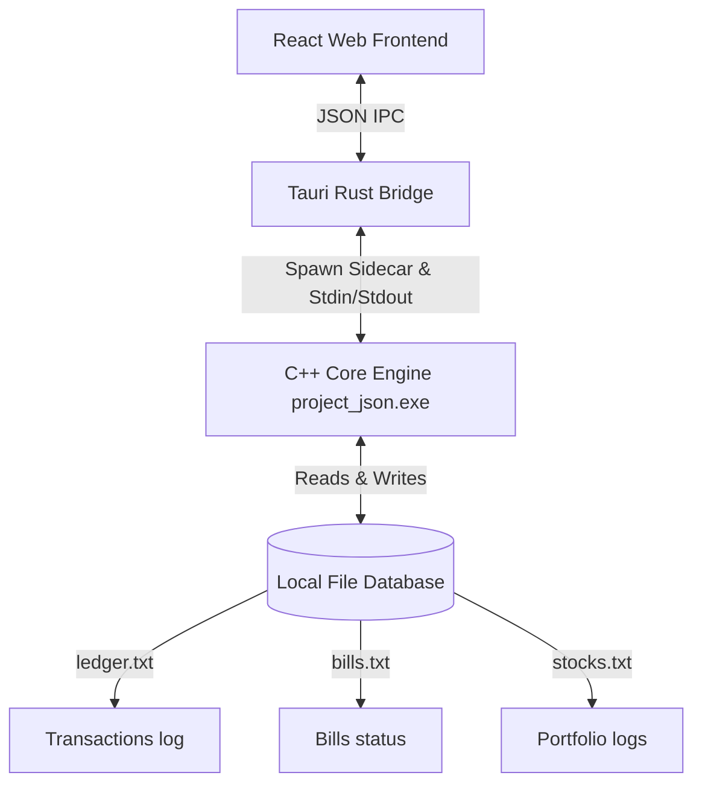

# Aegis Finance 🛡️
### Personal Finance Management & Stock Portfolio Simulation System

A hybrid desktop application built with a high-performance **C++ Object-Oriented Core Engine** and a modern, premium **React / TypeScript GUI** wrapped in **Tauri**. Designed as a comprehensive course project demonstrating advanced software architecture, file serialization, object-oriented design patterns, and cross-language IPC bridging.

---

## 🎓 Academic Information
*   **Institution:** [Insert Your University Name]
*   **Course:** [Insert Course Title, e.g., CS-201: Object-Oriented Programming]
*   **Instructor:** [Insert Instructor Name / Professor Name]
*   **Developers:**
    *   [Insert Your Name] - [Insert Roll/Student ID]
    *   [Insert Partner Name (if applicable)] - [Insert Roll/Student ID]
*   **Submission Date:** [Insert Date]

---

## 🏛️ System Architecture

Aegis Finance uses a decoupled hybrid architecture that bridges low-level compiled performance with premium web aesthetics:



1.  **C++ Core Engine**: Implements the business logic, ledger management, double-entry transaction record keeping, compound interest, stock profits, tax allocations, and late penalties. It communicates using standard JSON streams via standard I/O.
2.  **Tauri Rust Bridge**: Exposes a secure IPC command `run_finance_command` which spawns the compiled C++ binary as a sub-process (sidecar), writes commands to standard input, and returns database updates from standard output.
3.  **React / TypeScript GUI**: A responsive, dark-themed dashboard styled with premium glassmorphic UI components, real-time interactive charts, transactional staging zones, and user profile management.

---

## ✨ Features Included

### 📊 Financial Ledger & Double-Entry Accounting
*   **Salary Crediting**: Records monthly income and auto-calculates baseline metrics.
*   **Double-Entry Liquidation**: Automatically logs both principal refunds and net capital gains/losses in separate records upon asset sales to maintain accounting transparency.
*   **Consolidate Savings**: Safely locks remaining liquid cash at the end of the month into a separate long-term savings pool.

### 🧾 Utility Bill & Expense Management
*   **Auto Tax Allocation**: Automatically splits incoming bills to deduct a 5% tax component.
*   **Late Fee Penalty Calculator**: Applies a 3% late penalty on overdue bills plus a daily increment to prevent default.
*   **Staged Balance Validation Scanner**: Validates the total projected cash balance before saving. If your staged expenses exceed your funds, the scanner blocks commits and displays a warnings banner to prevent overdrafts.

### 📈 Pro-Trading Stock Simulator & Interactive Charts
*   **15 Live Assets**: Simulates price volatility and ticks for BTC, ETH, SOL, stock equities, and assets.
*   **Smooth Navigation Chart**: A custom-wrapped candlestick chart utilizing ApexCharts with:
    *   Native wheel scroll zooming (5% rate) for granular viewports.
    *   Fluid mouse drag panning to slide back through historical trends.
    *   Ref-buffered updates to prevent layout jumping or resetting on live price ticks.

---

## 🛠️ Languages & Technologies Used

*   **Core Logic**: C++ (OOP, STL Streams, File I/O, Custom Serialization)
*   **IPC Bridge**: Rust (Tauri v2 Shell plugins)
*   **GUI Framework**: React (v19), TypeScript, Vite
*   **Styling**: Vanilla CSS (CSS Variables, Flexbox/Grid, custom Glassmorphic layers)
*   **Data Visualization**: ApexCharts / React-ApexCharts

---

## 📂 Repository Directory Layout

You can place academic documents, slide decks, and project reports in the `/documents` folder, and screenshots in `/assets`.

```
├── C++ Core Files (Main Engine)
│   ├── finance_core/
│   │   ├── finance_core.cpp    # Core OOP Class implementations
│   │   └── finance_core.h      # Core OOP declarations
│   ├── main_cli.cpp            # C++ Command-line interface frontend
│   └── main_json.cpp           # JSON stream command dispatcher
│
├── documents/                  # Place your PDFs, presentations & reports here!
│   └── project_report.pdf
│
├── assets/                     # Store Readme screenshots and images here
│   └── dashboard_mockup.png
│
├── src/                        # React Frontend Source Code
│   ├── App.tsx                 # Main GUI dashboard & state machine
│   ├── App.css                 # Premium glassmorphic styling
│   └── main.tsx                # React mount point
│
├── src-tauri/                  # Tauri Desktop Wrappers
│   ├── binaries/               # Compiled C++ sidecar binaries
│   ├── src/                    # Rust backend command IPC route handlers
│   ├── tauri.conf.json         # Desktop client configurations
│   └── Cargo.toml              # Rust build manifest
```

---

## 🚀 How to Run the Project

### 1. Build and Run C++ Command Line Interface (CLI)
If you want to run the core engine separately in terminal mode:
```bash
# Compile core engine with CLI frontend
g++ -O3 main_cli.cpp finance_core/finance_core.cpp -o aegis_cli.exe

# Run the CLI app
./aegis_cli.exe
```

### 2. Build the Tauri Desktop Application
To run the full hybrid desktop app with the React GUI:

**Prerequisites**: Install [Node.js](https://nodejs.org/), [Rust (rustup)](https://rustup.rs/), and [MinGW (g++)](https://www.mingw-w64.org/).

```bash
# 1. Install frontend dependencies
npm install

# 2. Compile C++ Sidecars for the desktop client
g++ -O3 main_json.cpp finance_core/finance_core.cpp -o project_json.exe

# 3. Copy compiled binaries to Tauri sidecar directories
copy project_json.exe src-tauri/binaries/project_json-x86_64-pc-windows-gnu.exe
copy project_json.exe src-tauri/binaries/project_json-x86_64-pc-windows-msvc.exe

# 4. Start the application in development mode
npm run tauri dev
```

### 3. Build a Production Installer
To bundle the application into a standalone desktop installer (`.msi` or `.exe`):
```bash
npm run tauri build
```
The installer will be generated in `src-tauri/target/release/bundle/`.

---

## 🌐 Web Hosting on Vercel
A static preview of the **React frontend** can be hosted on Vercel. 
*Note: Because web browsers operate inside sandboxes, the web-hosted version cannot execute local C++ binaries. It serves as a visual showcase of the UI and components. The full data pipeline requires running the Tauri desktop client.*
